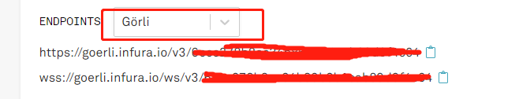
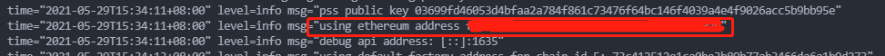
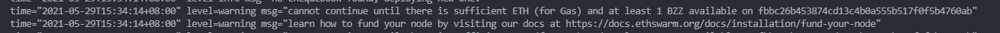

## Swarm Bzz教程

### 安装客户端（windows）

官网下载地址 [bee](https://github.com/ethersphere/bee/releases/tag/v0.6.0)

找不到bee-windows-amd64.exe，找不到就直接ctrl+f搜索

把下载下来的包放到你最大的磁盘中随便新建一个文件夹，不要带中文

打开的windows自带的终端(cmd)，进入到刚刚创建的文件路径下。

### 配置
生成配置文件, 输入 ```bee-windows-amd64 printconfig & bee-default.yaml``` 生成默认文件，大概如下。

```
api-addr: :1633
block-time: "15"
bootnode:
- /dnsaddr/bootnode.ethswarm.org
bootnode-mode: false
cache-capacity: "1000000"
clef-signer-enable: false
clef-signer-endpoint: ""
clef-signer-ethereum-address: ""
cors-allowed-origins: []
data-dir: /Users/sig/.bee
db-block-cache-capacity: "33554432"
db-disable-seeks-compaction: false
db-open-files-limit: "200"
db-write-buffer-size: "33554432"
debug-api-addr: :1635
debug-api-enable: false
full-node: false
gateway-mode: false
global-pinning-enable: false
help: false
nat-addr: ""
network-id: "1"
p2p-addr: :1634
p2p-quic-enable: false
p2p-ws-enable: false
password: ""
password-file: ""
payment-early: "1000000000000"
payment-threshold: "10000000000000"
payment-tolerance: "10000000000000"
postage-stamp-address: ""
resolver-options: []
standalone: false
swap-enable: true
swap-endpoint: ws://localhost:8546
swap-factory-address: ""
swap-initial-deposit: "10000000000000000"
swap-legacy-factory-addresses: []
tracing-enable: false
tracing-endpoint: 127.0.0.1:6831
tracing-service-name: bee
transaction: ""
verbosity: info
welcome-message: ""
```

需要修改的地方有：
```
debug-api-enable: true
full-node: true
verbosity: trace
swap-endpoint: '这个地址需要自己去申请'
```

### 申请swap-endpoint地址

[swap-endpoint](https://infura.io/)

邮箱注册，创建一个项目，进入项目之后现在settings, 可以看到如下：



复制当前地址填入swap-endpoint字段

### 启动bee
终端中输入命令 ``` bee-windows-amd64 start --config bee-default.yaml ```

第一次启动会让你设置密码

成功后，会给你一个eth钱包地址，复制你的ETH地址



然后去[https://goerli.etherscan.io/](https://goerli.etherscan.io/) 兑换成receiver地址

这个地址主要是为了去领取官方发给你的gEth，因为没有这个币，你是挖不了Bzz的。会提示如下错误。



### 领取gETH

[官方渠道](https://discord.com/invite/kfKvmZfVfe) 注册一下账号，然后进去找机器人验证一下code码，这样你才可以发言

然后跳入到faucet频道，输入/faucet sprinkle 你的receiver地址领取gETH币。回到刚刚的终端，重新启动。
